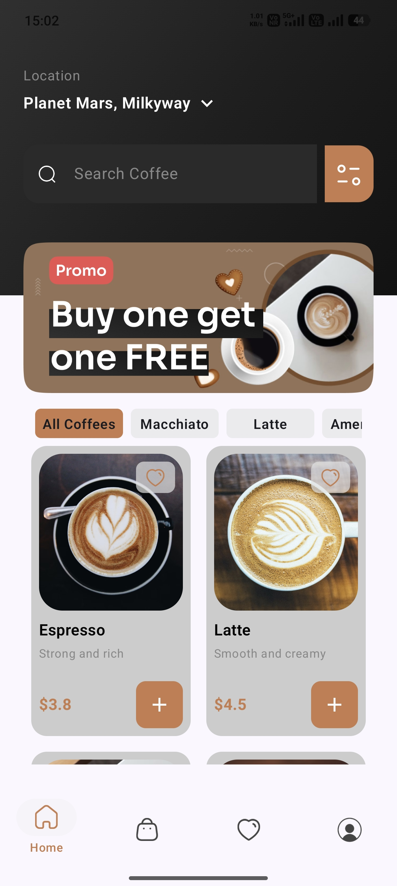
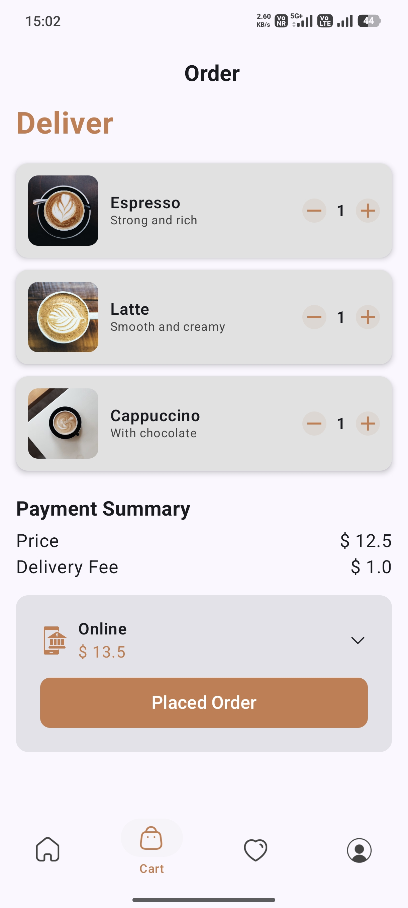
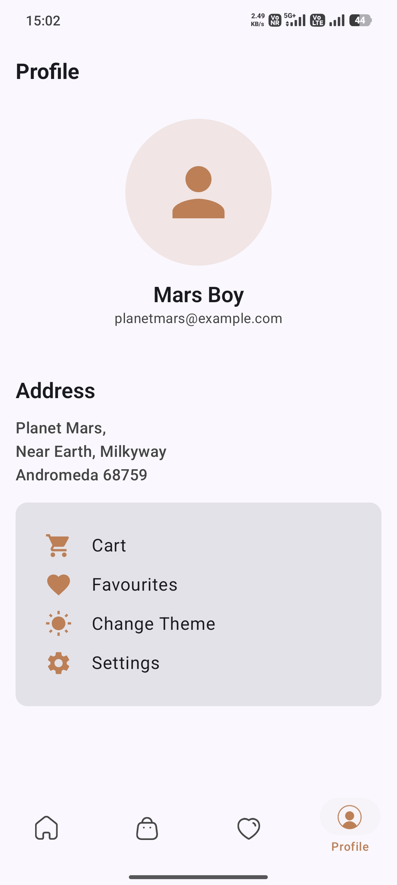
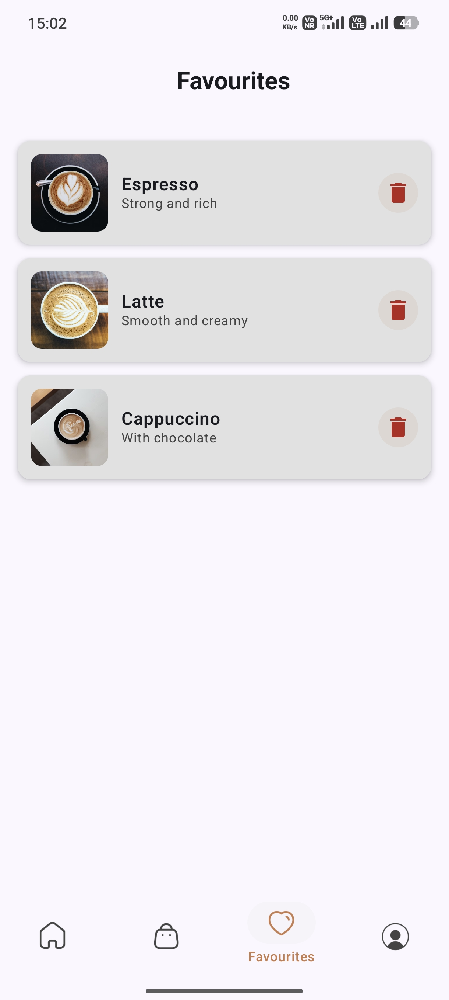

# ☕ Coffee App (Jetpack Compose)

A modern Android Coffee Ordering App built using **Jetpack Compose**.
This project demonstrates clean UI design, reusable components, and modern Android development practices.

---

## 📱 Features

* 🛒 Cart Screen with item listing
* 💳 Payment Selection UI (Dropdown Menu)
* 📦 Order Summary & Checkout
* 👤 Profile Screen with user details
* ❤️ Favourites Section
* 🎨 Change Theme option
* ⚙️ Settings UI
* ✨ Clean and modern UI using Compose

---

## 🛠️ Tech Stack

* **Kotlin**
* **Jetpack Compose**
* **Material 3**
* **Android Studio**

---

## 📱 Screenshots

| Welcome Screen | Home Screen |
|---------------|------------|
|  |  |

| Cart Screen | Profile Screen |
|-------------|---------------|
|  |  |

| Menu / Items Screen |
|--------------------|
|  |

---

## 🚀 Getting Started

### 1. Clone the repository

```bash
git clone https://github.com/programmer-kunal/Brewly.git
```

### 2. Open in Android Studio

* Open Android Studio
* Click on **Open Project**
* Select the cloned folder

### 3. Run the app

* Connect emulator or device
* Click ▶️ Run

---

## 📂 Project Structure

```
📦 com.example.brewly
 ┣ 📂 screens
 ┃ ┣ 📄 CartScreen.kt
 ┃ ┣ 📄 ProfileScreen.kt
 ┃ ┗ 📄 PaymentModeSelectionCard.kt
 ┣ 📂 components
 ┃ ┗ 📄 Reusable UI Components
 ┗ 📄 MainActivity.kt
```

---

## 💡 What I Learned

* Building UI using Jetpack Compose
* Managing layouts (Row, Column, Box)
* Creating reusable composables
* Handling UI state (Dropdown Menu)
* Designing modern Android UI

---

## 🔮 Future Improvements

* Add backend (Firebase / API)
* Add authentication (Login / Signup)
* Add real payment integration
* Improve animations

---

## 🤝 Contributing

Feel free to fork this repo and improve it.

---

## 📄 License

This project is open-source and available under the MIT License.

---

## 👨‍💻 Author

**Kunal**
GitHub: https://github.com/programmer-kunal
